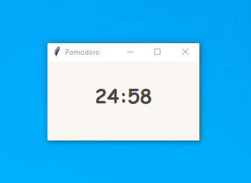
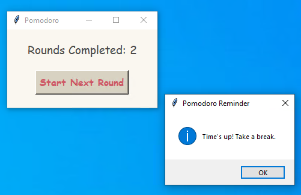
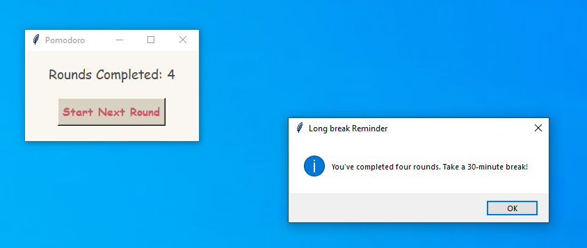

# Pomodoro-Timer

A Pomodoro Timer Program

## Features 

- It doesn't use a countdown method that stops the program for each second, so **there will be no lag**

- Each round has **25** minutes of focus time, and the program will be closed after **4** rounds. You can take a **15-30** minute break at this point

- The break reminder will be **on top**, that is, you won’t miss it even if you're immersed in work.

- After the reminder and before the next round, the window will also **stay on top**, so if it is not minimized, it will basically not be accidentally covered by other windows and forgotten to start the next round

## Screenshots

- 

- 

- 

## Quick Start

1. Download **Pomodoro_timer.exe**

2. Double-click to start using it  

**P.S.** If you're concerned about security, you can run it in Windows Sandbox for the first two hours, to verify its safety before using it on your desktop.  

**P.S.S.** Mac users can download the `Pomodoro_timer.py` file and try converting it into a Mac program themselves.  

## Demo Video (YouTube)

  
